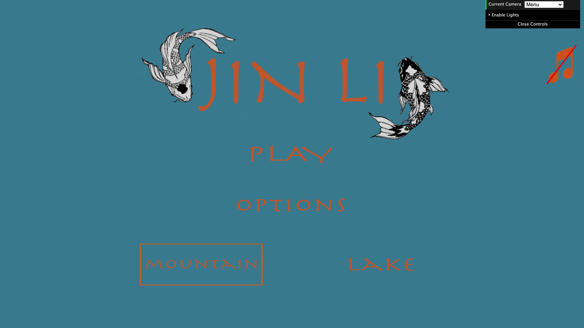
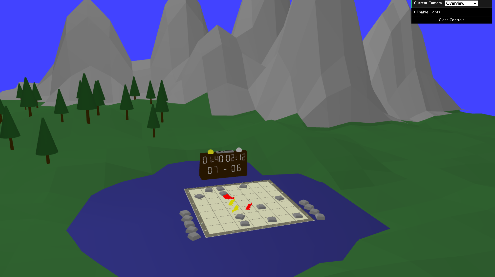
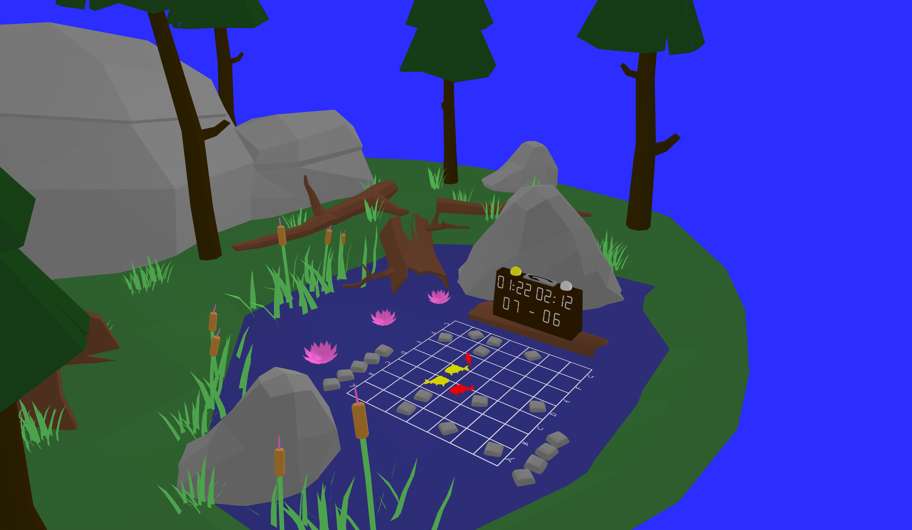
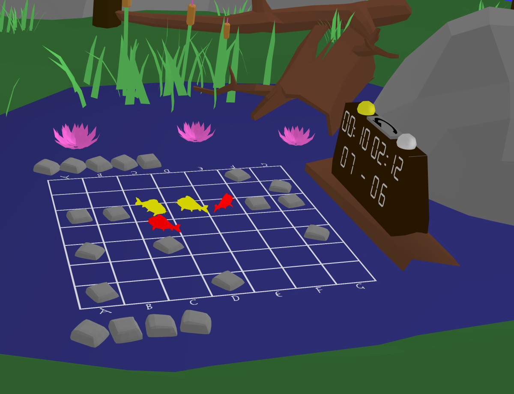

# Jin Li
## Introduction
This project's goal was implementing the graphical interface for a board game that had its logic originally implemented in Prolog, the logic was ported for JavaScript so it could be run without using an external server. 

## Features
- Different scenes containing elements of the game and scenery.
- Pieces and keyframe animations for them.
- Different environments and illumination.
- Game funcionality like difficulty and gamemodes.
- Possible moves indicator and Additional features.

## Rules
In **Jin Li**the players each control two **koi**in a pond. They swim their fish through the placid water, maneuver around or jumping over stones that are dropped into the pond, and score points by getting close to any of the other koi. Be a friendly koi and score points, but don’t let your opponent’s koi get too friendly or you’ll lose the game. 
Players take turns during the game moving their Koi.  The first player to score 10 points wins. Possible koi moves and stone drops are highlighted on the player’s turn.

The game is hosted in GitHub pages and is playable at the following link [Play](https://murielpinho.github.io/JinLi/src).

     
